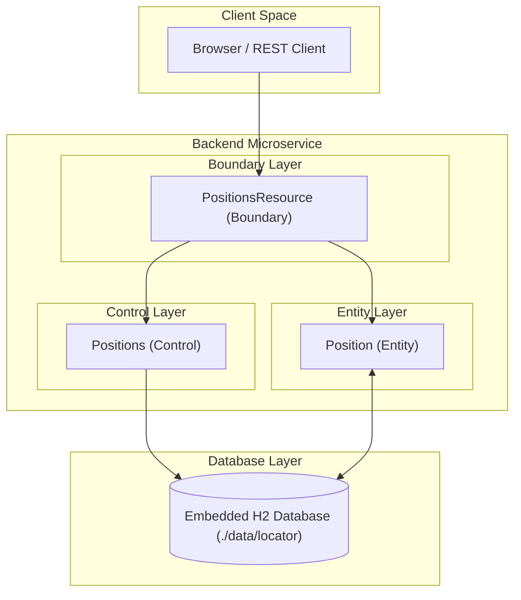

# Locate.me – Geo-Location Tracking System

A modern, highly structured geo-location tracking application designed to persist, query, and manage geographic positions. The project is split into a frontend client and an ECB-compliant Quarkus backend microservice.

---

## 1. Project Structure

The project repository is structured as follows:

```
locate.me/
 ├── frontend/       # Frontend client-side application
 ├── backend/        # Main backend service (Quarkus 3.33.2 microservice)
 └── backend-st/     # Separated system test suite using MicroProfile REST clients
```

---

## 2. Frontend Layer (`frontend/`)

The frontend folder contains the client-side component of the application. It interacts directly with the backend's RESTful web endpoints to display real-time positions, allow users to submit new locations, and delete unwanted entries.

---

## 3. Backend Layer (`backend/`)

The backend is built as a highly structured, secure-by-default Java 21 microservice using **Quarkus 3.33.2 (LTS)** and an embedded, file-based **H2 database**. It strictly follows the **Boundary-Control-Entity (BCE)** architectural pattern to achieve maximal cohesion and minimal coupling.

### 3.1 Business Components: `Locator`

The core domain responsibility of the backend is managed by the **Locator** Business Component under the package `net.gauntlet.locate.me.locator`. 

#### Domain Capabilities
*   **Create Geo-Positions**: Ingests new position records, runs strict Bean Validation, and persists them.
*   **Search/Query Positions**: Supports querying positions globally or filtering them specifically by a given `userId`. Records are returned sorted by timestamp in descending order.
*   **Delete Positions**: Safely removes recorded positions by their technical primary key.

#### Position Entity Attributes
Each recorded geo-position consists of the following attributes:
*   `id` (Long, technical primary key): Automatically generated using a database sequence.
*   `userId` (String, mandatory): Identifier of the user (maximum 32 characters).
*   `latitude` (double, mandatory): Latitude coordinate.
*   `longitude` (double, mandatory): Longitude coordinate.
*   `accuracy` (Double, optional): Accuracy radius in meters.
*   `timestamp` (Instant, mandatory): Explicit point in time when the position was recorded.

---

### 3.2 IT Architecture (BCE Layers)

The backend follows the Boundary-Control-Entity pattern. To ensure loose coupling and seamless API evolution, all external communication uses **JSON-P (`jakarta.json.JsonObject`)** instead of exposing direct entity mappings to clients.

*   **Boundary Layer (`boundary/`)**: 
    Exposes Restful APIs using JAX-RS. The `PositionsResource` JAX-RS facade is annotated with `@Boundary` (Request-scoped), is the exclusive holder of `@Transactional` boundary controls, handles Bean Validation on deserialized entity models, and delegates operations directly to the controller.
*   **Control Layer (`control/`)**: 
    Zustandslose/Stateless business logic classes. `Positions` BA is annotated with `@Control` (Dependent-scoped) and performs operations using an injected package-private `EntityManager`.
*   **Entity Layer (`entity/`)**: 
    Represents persistent state and core business logic. The `Position` JPA Entity exposes a record-style getter interface (e.g. `userId()` instead of `getUserId()`) and encapsulates its own JSON-P transformations (`toJSON()` and `fromJSON()`).

---

### 3.3 Health, Readiness, and Liveness Architecture

To ensure high availability and robust container orchestration (e.g., within Kubernetes), the backend implements the **MicroProfile Health** specification through the `quarkus-smallrye-health` extension. This isolates application lifecycle concerns into two distinct standard endpoints:

#### 3.3.1 Readiness Check (`/q/health/ready`)
*   **Purpose**: Verifies if the container is currently capable of handling incoming business requests (i.e., whether the database is accessible).
*   **Implementation**: Done via `DatabaseHealthCheck.java`. It executes a native ping query (`SELECT 1`) on the embedded H2 database using an injected `EntityManager`.
*   **Orchestration Behavior**: If this check fails (e.g., due to database locks or temporary connection loss), the orchestrator (Kubernetes) stops routing client traffic to this specific instance. The container is **not** restarted.

#### 3.3.2 Liveness Check (`/q/health/live`)
*   **Purpose**: Monitors if the JVM process itself is healthy and running, or if it is stuck in an unrecoverable state (e.g., deadlocks or Out-of-Memory).
*   **Implementation**: Delegates directly to standard internal JVM and system resource checks. Following cloud-native best practices, it deliberately **does not query database connections** to prevent cascading container restarts during minor database hiccups.
*   **Orchestration Behavior**: If this check fails, the orchestrator immediately kills and restarts the container to auto-heal the instance.

#### BCE Architectural Flow & Database Layer



---

## 4. Local Development, Build & Testing

### Prerequisites
*   **Java 21** or higher
*   **Maven 3.9+**

---

### 4.1 Building the Application
To compile all modules and build local executable artifacts, run the following command from the root directory:

```bash
# Build backend and system tests
mvn clean package
```

---

### 4.2 Running the Application locally

#### Option A: Dev Mode (Hot Reloading)
You can start the Quarkus backend in development mode. In this mode, live coding is enabled, and an in-memory database is used automatically.

```bash
cd backend
mvn quarkus:dev
```
*   The application will be accessible at: `http://localhost:8080`
*   The Swagger UI will be available at: `http://localhost:8080/q/swagger-ui`

#### Option B: Production Runner
To build and execute the application with a persistent file-based H2 database (`./data/locator`), run:

```bash
cd backend
mvn package
java -jar target/quarkus-app/quarkus-run.jar
```

---

### 4.3 Running Tests

Tests are divided into three isolated tiers matching corporate guidelines:

#### Tier 1 & 2: Unit and Local Integration Tests (`backend`)
*   **Unit Tests (`PositionTest.java`)**: Validates JSON-P serialization, deserialization, and record-style mapping.
*   **Local Integration Tests (`PositionsResourceIT.java`)**: Spins up a local test environment, activates the H2 database, executes API calls via RestAssured, and tests edge cases and validation rules (e.g., throwing HTTP 400 when user IDs exceed 32 characters).

To run these tests:
```bash
cd backend
mvn clean test failsafe:integration-test
```

#### Tier 3: Out-of-Process System Integration Tests (`backend-st`)
*   **System Tests (`PositionsSystemIT.java`)**: Verifies system fidelity using an independent module. It communicates with a running instance of your microservice through a typed MicroProfile REST Client (`PositionsResourceClient`).

To run system tests (make sure the backend is already running on port `8080` via `mvn quarkus:dev` or `java -jar`):
```bash
cd backend-st
mvn clean verify
```

