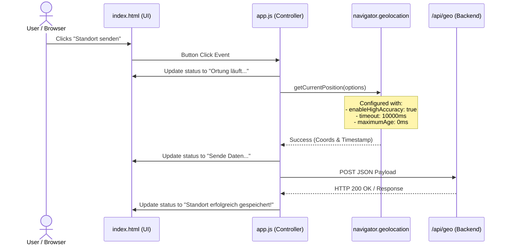
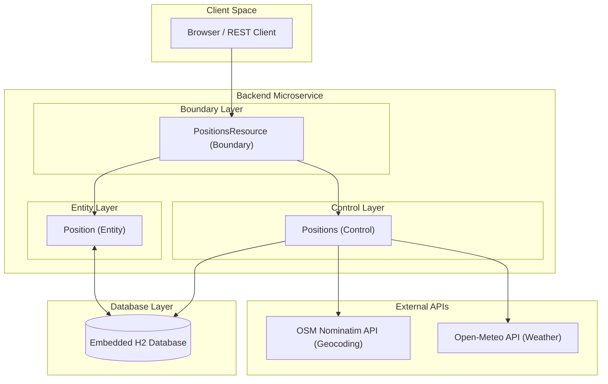

# Locate.me – Geo-Location Tracking System

A modern, highly structured geo-location tracking application designed to persist, query, and manage geographic positions. The project is split into a frontend client and an ECB-compliant Quarkus backend microservice.

---

## 1. Project Structure

The project repository is structured as follows:

```
locate.me/
 ├── frontend/       # Frontend client-side application
 ├── backend/        # Main backend service (Quarkus 3.33.2 microservice)
 └── backend-st/     # Separated system test suite using MicroProfile REST clients
```

---

## 2. Frontend Layer (`frontend/`)

The frontend is a lightweight, mobile-first **Progressive Web App (PWA)** built using standard web technologies (HTML5, CSS3, and Vanilla JavaScript). It is designed to run in modern mobile and desktop browsers, requesting real-time high-accuracy geolocation coordinates from the physical device and dispatching them securely to the backend service.

---

### 2.1 Core Components & Structure

*   **`index.html` (Application Shell)**: Defines the minimal HTML structure required to boot the application. It provides the main user interface container, registers the service worker, and includes the action button and status feedback element.
*   **`app.js` (Core Application Controller)**: Orchestrates device interaction, handles user events, manages state transitions, and handles network communications.
*   **`sw.js` (Service Worker)**: Implements lifecycle event handling (`install` and `fetch` events) enabling standard Progressive Web App capabilities.
*   **`manifest.json` (Web App Manifest)**: Controls how the application appears to the user on their device (standalone display mode, theme colors, and icons), allowing it to be installed locally like a native app.
*   **`css/style.css` (Visual Presentation)**: Styles the mobile-first layouts, ensuring touch targets (like the "Standort senden" tracking button) are prominent and responsive.

---

### 2.2 Geolocation Tracking Flow

When a user triggers tracking, the frontend executes a coordinated flow to request coordinates, transform them into the required domain payloads, and submit them:



#### 1. Device Location Fetching
Using `navigator.geolocation.getCurrentPosition()`, the controller asks the browser to obtain the current latitude, longitude, and accuracy of the device. High-precision options are enforced:
- `enableHighAccuracy: true`: Forces the browser/device to use hardware GPS modules if available for fine-grained coordinates rather than coarse IP-based tracking.
- `timeout: 10000`: Sets a strict 10-second limit on location acquisition to prevent UI hangs.
- `maximumAge: 0`: Guarantees fresh real-time coordinates, bypassing any cached positions.

#### 2. Payload Construction & Mapping
Once coordinates are acquired, the raw browser coordinates are parsed and structured into the domain JSON model required by the backend:
- `userId`: Currently a static placeholder (`user_static_1`), ready for future authentication integration.
- `latitude` / `longitude`: Exact decimal degree numbers.
- `accuracy`: Margin of error in meters (if provided by the device).
- `timestamp`: The system-acquired timestamp converted to a standardized **ISO 8601 string** format (e.g., `2026-06-11T22:00:00.000Z`) for consistent database persistence.

#### 3. State-Driven User Feedback
The status banner is updated reactively throughout the lifecycle of the location check:
- `Bereit` (Initial state)
- `Ortung läuft...` (Acquiring physical GPS coordinate)
- `Sende Daten an Backend...` (Performing fetch transmission)
- `Standort erfolgreich gespeichert!` (Success state)
- `Fehler bei der Ortung: [Error Message]` / `Verbindungsfehler zum Backend.` (Failure branches)

---

## 3. Backend Layer (`backend/`)

The backend is built as a highly structured, secure-by-default Java 21 microservice using **Quarkus 3.33.2 (LTS)** and an embedded, file-based **H2 database**. It strictly follows the **Boundary-Control-Entity (BCE)** architectural pattern to achieve maximal cohesion and minimal coupling.

### 3.1 Business Components: `Locator`

The core domain responsibility of the backend is managed by the **Locator** Business Component under the package `net.gauntlet.locate.me.locator`. 

#### Domain Capabilities
*   **Create Geo-Positions**: Ingests new position records, runs strict Bean Validation, enriches them asynchronously/synchronously with external metadata (geocoding via OpenStreetMap Nominatim and current weather conditions via Open-Meteo), and persists them.
*   **Search/Query Positions**: Supports querying positions specifically filtered by a given `userId`. If the optional parameters `lat` and `lon` are provided, the system automatically calculates the distance (orthodromic distance via the Haversine formula) in kilometers between the specified reference point and each recorded position. Records are returned sorted by timestamp in descending order.
*   **Delete Positions**: Safely removes recorded positions by their technical primary key.

#### Position Entity Attributes
Each recorded geo-position consists of the following attributes:
*   `id` (Long, technical primary key): Automatically generated using a database sequence.
*   `userId` (String, mandatory): Identifier of the user. Formatted as alphanumeric with a maximum of 16 characters. All REST endpoints expect this as a mandatory query parameter (`userId`) and perform authorization checks against a configuration-driven list in `application.properties` (`allowed.user.ids`).
*   `latitude` (double, mandatory): Latitude coordinate.
*   `longitude` (double, mandatory): Longitude coordinate.
*   `accuracy` (Double, optional): Accuracy radius in meters.
*   `displayName` (String, optional): Optional display name/label resolved via OpenStreetMap Nominatim (maximum 255 characters).
*   `temperature` (Float, optional): Current ambient temperature in °C resolved via Open-Meteo API.
*   `weatherCode` (WeatherCode, optional): Current weather condition classification (mapped via WMO Weather Interpretation Codes).
*   `timestamp` (Instant, mandatory): Explicit point in time when the position was recorded.

---

### 3.2 IT Architecture (BCE Layers)

The backend follows the Boundary-Control-Entity pattern. To ensure loose coupling and seamless API evolution, all external communication uses **JSON-P (`jakarta.json.JsonObject`)** instead of exposing direct entity mappings to clients.

*   **Boundary Layer (`boundary/`)**: 
    Exposes Restful APIs using JAX-RS. The `PositionsResource` JAX-RS facade is annotated with `@Boundary` (Request-scoped), is the exclusive holder of `@Transactional` boundary controls, handles Bean Validation on deserialized entity models, and delegates operations directly to the controller.
*   **Control Layer (`control/`)**: 
    Zustandslose/Stateless business logic classes. `Positions` BA is annotated with `@Control` (Dependent-scoped) and performs operations using an injected package-private `EntityManager`. It acts as an orchestrator that leverages CDI-injected MicroProfile REST clients (`GeocodingClient` and `WeatherClient`) to automatically query and enrich incoming coordinates with real-time location addresses and weather metrics.
*   **Entity Layer (`entity/`)**: 
    Represents persistent state and core business logic. The `Position` JPA Entity exposes a record-style getter interface (e.g. `userId()` instead of `getUserId()`) and encapsulates its own JSON-P transformations (`toJSON()` and `fromJSON()`). It maps optional parameters such as `temperature` and `weatherCode`. The weather condition is represented as a structured `WeatherCode` enum, which is persisted to the database via a JPA `AttributeConverter` (`WeatherCodeConverter`).

---

### 3.3 Health, Readiness, and Liveness Architecture

To ensure high availability and robust container orchestration (e.g., within Kubernetes), the backend implements the **MicroProfile Health** specification through the `quarkus-smallrye-health` extension. This isolates application lifecycle concerns into two distinct standard endpoints:

#### 3.3.1 Readiness Check (`/q/health/ready`)
*   **Purpose**: Verifies if the container is currently capable of handling incoming business requests (i.e., whether the database is accessible).
*   **Implementation**: Done via `DatabaseHealthCheck.java`. It executes a native ping query (`SELECT 1`) on the embedded H2 database using an injected `EntityManager`.
*   **Orchestration Behavior**: If this check fails (e.g., due to database locks or temporary connection loss), the orchestrator (Kubernetes) stops routing client traffic to this specific instance. The container is **not** restarted.

#### 3.3.2 Liveness Check (`/q/health/live`)
*   **Purpose**: Monitors if the JVM process itself is healthy and running, or if it is stuck in an unrecoverable state (e.g., deadlocks or Out-of-Memory).
*   **Implementation**: Delegates directly to standard internal JVM and system resource checks. Following cloud-native best practices, it deliberately **does not query database connections** to prevent cascading container restarts during minor database hiccups.
*   **Orchestration Behavior**: If this check fails, the orchestrator immediately kills and restarts the container to auto-heal the instance.

#### BCE Architectural Flow & Database Layer



---

### 3.4 External Service Integrations & Fault-Tolerance

To provide automated data enrichment upon position creation, the backend integrates with external RESTful web APIs using declarative MicroProfile REST Clients.

#### 3.4.1 Open-Meteo Weather API Integration
*   **Purpose**: Resolves the current ambient temperature and weather condition code for the given coordinates.
*   **Endpoint**: `/v1/forecast` relative to the configured base URL.
*   **Parameters**:
    *   `latitude`: Requested coordinate.
    *   `longitude`: Requested coordinate.
    *   `current`: Configured to retrieve `"temperature_2m,weather_code"`.
*   **Configuration**:
    *   Client Interface: `WeatherClient.java`
    *   Config Key: `weather_uri/mp-rest/url` (defaults to `https://api.open-meteo.com`)

#### 3.4.2 OpenStreetMap Nominatim Geocoding API Integration
*   **Purpose**: Resolves the physical address or landmark name (reverse geocoding) for the given coordinates, which is mapped to the `displayName` attribute.
*   **Endpoint**: `/reverse` relative to the configured base URL.
*   **Parameters**:
    *   `lat`: Requested coordinate.
    *   `lon`: Requested coordinate.
    *   `format`: Configured to retrieve `"jsonv2"`.
*   **Configuration**:
    *   Client Interface: `GeocodingClient.java`
    *   Config Key: `nominatim_uri/mp-rest/url` (defaults to `https://nominatim.openstreetmap.org`)
    *   **Custom Headers**: Enforces a `User-Agent` header (`LocateMeApp/1.0 (internal@local.me)`) to comply with Nominatim's strict usage policy.

#### 3.4.3 Fault-Tolerance & Graceful Fallback
External network calls are prone to latency spikes, rate-limiting, and downtime. To ensure high availability and prevent external failures from disrupting the core system, the integrations implement a **Graceful Fallback pattern**:
*   **Error Isolation**: Both API calls are isolated inside separate, dedicated `try-catch` blocks in the `Positions.java` Control layer bean.
*   **Fail-Safe Persistence**: If an external service is unavailable, returns a timeout, or throws an HTTP error, the exception is caught, logged as a warning (`System.Logger.Level.WARNING`), and the core location coordinate is **successfully persisted** without the enriched fields (meaning `displayName`, `temperature`, and `weatherCode` remain `null` or hold default values).
*   **Resilience Benefit**: Users can always submit their coordinates regardless of third-party API availability, protecting the core application flow.

---

## 4. Local Development, Build & Testing

### Prerequisites
*   **Java 21** or higher
*   **Maven 3.9+**

---

### 4.1 Building the Application
To compile all modules and build local executable artifacts, run the following command from the root directory:

```bash
# Build backend and system tests
mvn clean package
```

---

### 4.2 Running the Application locally

#### Option A: Dev Mode (Hot Reloading)
You can start the Quarkus backend in development mode. In this mode, live coding is enabled, and an in-memory database is used automatically.

```bash
cd backend
mvn quarkus:dev
```
*   The application will be accessible at: `http://localhost:8080`
*   The Swagger UI will be available at: `http://localhost:8080/q/swagger-ui`

#### Option B: Production Runner
To build and execute the application with a persistent file-based H2 database (`./data/locator`), run:

```bash
cd backend
mvn package
java -jar target/quarkus-app/quarkus-run.jar
```

---

### 4.3 Running Tests

Tests are divided into three isolated tiers matching corporate guidelines:

#### Tier 1 & 2: Unit and Local Integration Tests (`backend`)
*   **Unit Tests (`PositionTest.java`)**: Validates JSON-P serialization, deserialization, and record-style mapping.
*   **Local Integration Tests (`PositionsResourceIT.java`)**: Spins up a local test environment, activates the H2 database, executes API calls via RestAssured, and tests edge cases and validation rules (e.g., throwing HTTP 400 when user IDs exceed 32 characters).

To run these tests:
```bash
cd backend
mvn clean test failsafe:integration-test
```

#### Tier 3: Out-of-Process System Integration Tests (`backend-st`)
*   **System Tests (`PositionsSystemIT.java`)**: Verifies system fidelity using an independent module. It communicates with a running instance of your microservice through a typed MicroProfile REST Client (`PositionsResourceClient`).

To run system tests (make sure the backend is already running on port `8080` via `mvn quarkus:dev` or `java -jar`):
```bash
cd backend-st
mvn clean verify
```

---

#### Tier 4: Manual Testing using cURL

You can manually interact with and test the RESTful API endpoints using `curl` while the backend application is running. All positions REST endpoints expect a mandatory, authorized `userId` (max 16 characters, alphanumeric) passed as a query parameter.

##### 1. Record a New Geo-Position (POST)
Creates a new position entry for an authorized user. If `displayName`, `temperature`, or `weatherCode` are omitted, the backend will automatically resolve them using the geocoding and weather APIs.
```bash
curl -i -X POST "http://localhost:8080/positions?userId=user123" \
  -H "Content-Type: application/json" \
  -d '{
    "userId": "user123",
    "latitude": 48.1351,
    "longitude": 11.5820,
    "accuracy": 10.5,
    "timestamp": "2026-06-11T22:00:00Z"
  }'
```
*Response payload showing automatic address and weather enrichment:*
```json
{
  "id": 1,
  "userId": "user123",
  "latitude": 48.1351,
  "longitude": 11.5820,
  "accuracy": 10.5,
  "displayName": "Marienplatz, Altstadt-Lehel, Munich, Upper Bavaria, Bavaria, 80331, Germany",
  "temperature": 16.8,
  "weatherCode": 2,
  "timestamp": "2026-06-11T22:00:00Z"
}
```

##### 2. Retrieve All Recorded Positions (GET)
Gets list of stored user locations matching the authorized user.
```bash
curl -i -X GET "http://localhost:8080/positions?userId=user123"
```

##### 3. Retrieve Positions with Distance Calculation (GET with optional lat/lon)
Gets user locations and calculates the distance in kilometers from a reference point (e.g., Munich) using the Haversine formula.
```bash
curl -i -X GET "http://localhost:8080/positions?userId=user123&lat=48.1351&lon=11.5820"
```
*Response payload showing automatic distance calculation in kilometers:*
```json
[
  {
    "id": 1,
    "userId": "user123",
    "latitude": 48.1351,
    "longitude": 11.5820,
    "accuracy": 10.5,
    "displayName": "Marienplatz, Munich, Germany",
    "temperature": 16.8,
    "weatherCode": 2,
    "timestamp": "2026-06-11T22:00:00Z",
    "distance": 0.0
  }
]
```

##### 4. Delete a Position (DELETE)
Removes a recorded position by its generated ID (e.g. ID `1`) for an authorized user.
```bash
curl -i -X DELETE "http://localhost:8080/positions/1?userId=user123"
```

##### 5. Check MicroProfile Readiness Check (GET)
Returns the system status and H2 database availability check.
```bash
curl -i -X GET http://localhost:8080/q/health/ready
```

##### 6. Check MicroProfile Liveness Check (GET)
Returns the state of the JVM process.
```bash
curl -i -X GET http://localhost:8080/q/health/live
```


